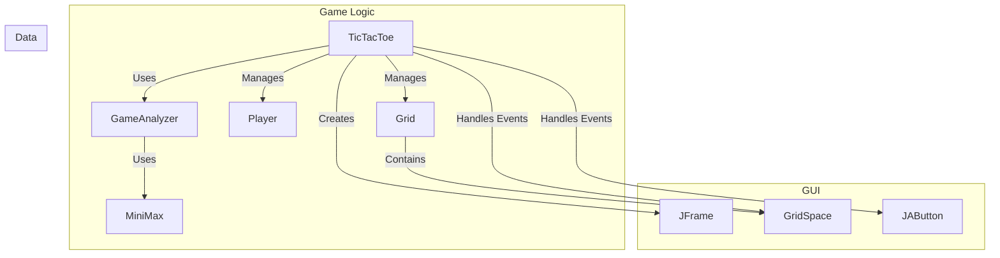

# TicTacToeGUI

A simple Tic-Tac-Toe game built with Java and the Swing GUI toolkit.

## Description

This project is a fully functional Tic-Tac-Toe game that can be played in a graphical window. It supports different game modes and features a computer opponent with varying difficulty.

## Features

*   **Multiple Game Modes:**
    *   **Player vs. Player:** Two human players can compete against each other.
    *   **Player vs. Computer:** Play against an AI opponent. The computer can be set to:
        *   **Normal:** Makes random moves.
        *   **Smart:** Uses the Minimax algorithm to make optimal moves.
    *   **Computer vs. Computer:** Watch a simulated game between two AI opponents.
*   **Score Tracking:** The game keeps track of wins, losses, and draws for each player.
*   **Interactive GUI:** A simple and intuitive graphical interface built with Java Swing.

## Tech Stack

The application is built using the following technologies:

*   **Java:** The core programming language.
*   **Java Swing:** For the graphical user interface.

### Class Diagram



## How to Run

1.  **Compile the code:**
    You can compile the Java files using a Java compiler. If you are using an IDE like IntelliJ IDEA or Eclipse, you can open the project and it should handle the compilation automatically. The compiled `.class` files are located in the `TTTGUI/out/production/TTTGUI` directory.

2.  **Run the application:**
    The main entry point of the application is the `main` method in the `TicTacToe.java` class. You can run this class from your IDE or from the command line.

    From the root directory of the project, you can run the following command, assuming the class files are in the correct output directory:

    ```bash
    java -cp TTTGUI/out/production/TTTGUI TicTacToe
    ```
